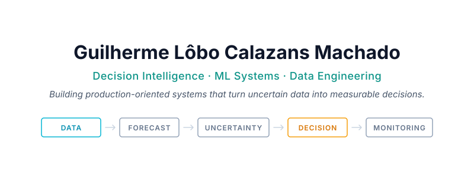
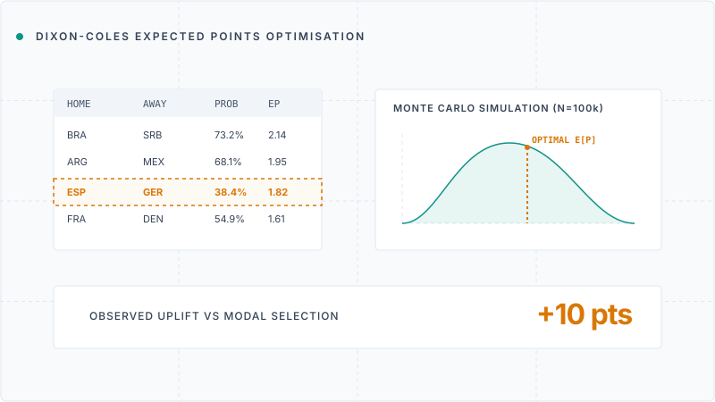
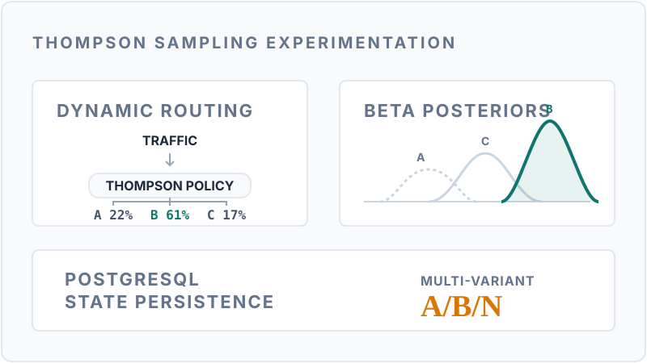

  <picture>
    
  </picture>

  <a href="#featured-systems"><strong>SYSTEMS</strong></a>
  &nbsp;·&nbsp;
  <a href="#engineering-evidence"><strong>EVIDENCE</strong></a>
  &nbsp;·&nbsp;
  <a href="#now-building"><strong>NOW BUILDING</strong></a>
  &nbsp;·&nbsp;
  <a href="#about-me"><strong>ABOUT</strong></a>
  &nbsp;·&nbsp;
  <a href="#contact"><strong>CONTACT</strong></a>

## What I Build

**01 &nbsp; DECISION INTELLIGENCE**  
Probabilistic forecasting, experimentation, causal inference, simulation and optimisation.

**02 &nbsp; PRODUCTION ML SYSTEMS**  
Training and inference pipelines, APIs, observability, testing, versioning and MLOps.

**03 &nbsp; DATA PLATFORMS**  
Ingestion, transformation, quality, analytical modelling, lineage and analytics.

---

## Featured Systems

**01 / DECISION SCIENCE**
### [PROBABILISTIC FOOTBALL POOL OPTIMISER](https://github.com/guilobocm/probabilistic-football-pool-optimiser)
> A reproducible decision system combining football probability modelling, Monte Carlo simulation and scoring-rule optimisation.

**DECISION PROBLEM**  
Choose predictions that maximise expected points, rather than simply selecting the most likely scoreline.

**SYSTEM**  
Dixon–Coles · Monte Carlo simulation · Scoring-rule optimisation · Reproducible pipeline

**EVIDENCE**  
100,000 simulations · 60.6% 1X2 accuracy · +10 observed points against modal selection

[**EXPLORE SYSTEM ↗**](https://github.com/guilobocm/probabilistic-football-pool-optimiser) &nbsp;·&nbsp; [**READ POST-MORTEM ↗**](https://github.com/guilobocm/probabilistic-football-pool-optimiser/tree/main/postmortem)

 

**02 / PRODUCTION ML SYSTEMS**
### [MULTI-ARMED BANDIT OPTIMISATION API](https://github.com/guilobocm/activeview-multi-armed-bandit)
> An online experimentation system that dynamically routes traffic to maximise cumulative reward during live campaigns.

**ENGINEERING PROBLEM**  
Allocate traffic across competing variants in real-time, balancing exploration of uncertain options with exploitation of the winning arm.

**SYSTEM**  
Thompson Sampling · FastAPI · PostgreSQL · Stateful Online Experimentation

**EVIDENCE**  
Sub-15ms allocation · Persistent state · Reproducible agent strategies

[**EXPLORE SYSTEM ↗**](https://github.com/guilobocm/activeview-multi-armed-bandit)

### [Industrial Data Extraction Pipeline](https://github.com/guilobocm/tractian-ml-challenge)
**Problem:** Extract and structure complex technical specifications from industrial catalogues.  
**System:** Web Scraping · Data Engineering · Pipeline Orchestration.  
**Evidence:** High-fidelity data models · Robust parsing of technical assets.  
[Explore Project](https://github.com/guilobocm/tractian-ml-challenge)

---

## Engineering Evidence

* ✓ Reproducible pipelines and locked environments
* ✓ Unit and end-to-end tests
* ✓ Data and schema validation
* ✓ CI quality gates
* ✓ Model and decision evaluation
* ✓ Auditable experiment outputs

---

## Tools I Work With

* **Modelling:** Python, PyTorch, scikit-learn, Statsmodels
* **Data:** SQL, PostgreSQL, Snowflake, Pandas
* **Engineering:** FastAPI, Docker, GitHub Actions, uv
* **Decision Systems:** Experimentation, MAB, Simulation, Optimisation

---

## About Me

I am a Data Scientist & ML Engineer based in Campinas, Brazil, with Wellington, New Zealand, on the horizon. My work spans from predictive maintenance in industrial settings to complex decision systems in sports analytics. I focus on the intersection of probabilistic modelling and business decision-making—building systems that don't just predict the future, but quantify uncertainty and optimise the actions taken from those predictions.

---

## Now Building

* **Entre-Eras:** cross-era sports modelling and historical simulation;
* **Open Decision Lab:** reusable architecture for forecasting and decision systems;
* **Railway Predictive Maintenance:** acoustic deep learning for fault detection and RUL;
* **MLOps depth:** observability, deployment strategies and model governance.

---

## Contact

* **LinkedIn**: [linkedin.com/in/guilhermelobocm](https://www.linkedin.com/in/guilhermelobocm)
* **Email**: [guilhermelobocm@gmail.com](mailto:guilhermelobocm@gmail.com)
* **Portfolio**: [github.com/guilobocm](https://github.com/guilobocm)
