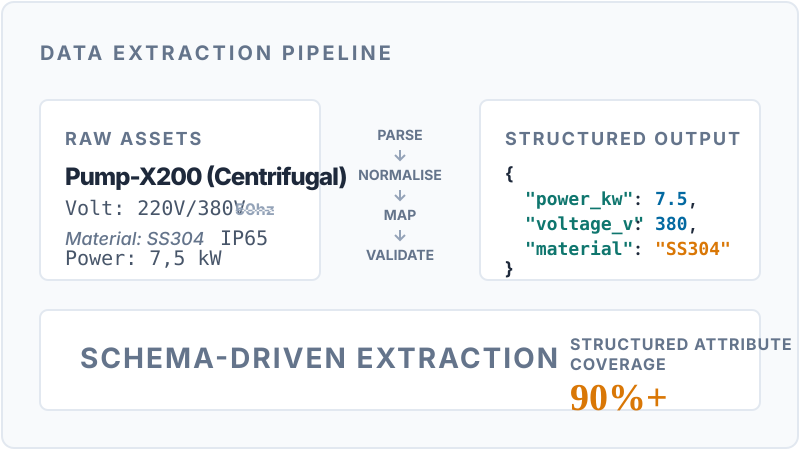

  <picture>
    
  </picture>

  <a href="#featured-systems"><strong>SYSTEMS</strong></a>
  &nbsp;·&nbsp;
  <a href="#engineering-evidence"><strong>EVIDENCE</strong></a>
  &nbsp;·&nbsp;
  <a href="#now-building"><strong>NOW BUILDING</strong></a>
  &nbsp;·&nbsp;
  <a href="#about-me"><strong>ABOUT</strong></a>
  &nbsp;·&nbsp;
  <a href="#contact"><strong>CONTACT</strong></a>

## What I Build

**01 &nbsp; DECISION INTELLIGENCE**  
Probabilistic forecasting, experimentation, causal inference, simulation and optimisation.

**02 &nbsp; PRODUCTION ML SYSTEMS**  
Training and inference pipelines, APIs, observability, testing, versioning and MLOps.

**03 &nbsp; DATA PLATFORMS**  
Ingestion, transformation, quality, analytical modelling, lineage and analytics.

---

## Featured Systems

**01 / DECISION SCIENCE**
### [PROBABILISTIC FOOTBALL POOL OPTIMISER](https://github.com/guilobocm/probabilistic-football-pool-optimiser)
> A reproducible decision system combining football probability modelling, Monte Carlo simulation and scoring-rule optimisation.

**DECISION PROBLEM**  
Choose predictions that maximise expected points, rather than simply selecting the most likely scoreline.

**SYSTEM**  
Dixon–Coles · Monte Carlo simulation · Scoring-rule optimisation · Reproducible pipeline

**EVIDENCE**  
100,000 simulations · 60.6% 1X2 accuracy · Directional +10-point uplift against modal selection

[**EXPLORE SYSTEM ↗**](https://github.com/guilobocm/probabilistic-football-pool-optimiser) &nbsp;·&nbsp; [**READ POST-MORTEM ↗**](https://github.com/guilobocm/probabilistic-football-pool-optimiser/tree/main/postmortem)

 

**02 / PRODUCTION ML SYSTEMS**
### [MULTI-ARMED BANDIT OPTIMISATION API](https://github.com/guilobocm/activeview-multi-armed-bandit)
> An online experimentation API that computes dynamic traffic allocations while balancing exploration and exploitation.

**ENGINEERING PROBLEM**  
Allocate traffic across competing variants in real-time, balancing exploration of uncertain options with exploitation of the winning arm.

**SYSTEM**  
Thompson Sampling · FastAPI · PostgreSQL · Stateful Online Experimentation

**EVIDENCE**  
Dynamic A/B/N allocation · PostgreSQL state persistence · Tested allocation constraints

[**EXPLORE SYSTEM ↗**](https://github.com/guilobocm/activeview-multi-armed-bandit)

 

**03 / DATA PLATFORMS**
### [INDUSTRIAL DATA EXTRACTION PIPELINE](https://github.com/guilobocm/tractian-ml-challenge)
> A data-engineering pipeline that transforms messy industrial catalogues into validated, structured technical data.

**ENGINEERING PROBLEM**  
Extract consistent product attributes from noisy, semi-structured technical documents with heterogeneous formats and incomplete fields.

**SYSTEM**  
Parsing pipeline · Attribute normalisation · Schema mapping · Validation logic

**EVIDENCE**  
12-product demo · Schema-aligned JSON outputs · Product, specification, BOM and asset extraction

[**EXPLORE SYSTEM ↗**](https://github.com/guilobocm/tractian-ml-challenge)

---

## Engineering Evidence

**REPRODUCIBILITY**  
Locked environments · deterministic execution · documented local workflows  
↳ [Football Optimiser](https://github.com/guilobocm/probabilistic-football-pool-optimiser) · [Entre-Eras](https://github.com/guilobocm/entre-eras)

**TESTING & QUALITY GATES**  
CI workflows · unit and smoke tests · Playwright end-to-end journeys  
↳ [Entre-Eras](https://github.com/guilobocm/entre-eras) — [CI proof ↗](https://github.com/guilobocm/entre-eras/blob/main/.github/workflows/ci.yml)  
↳ [Football Optimiser](https://github.com/guilobocm/probabilistic-football-pool-optimiser) — [validation proof ↗](https://github.com/guilobocm/probabilistic-football-pool-optimiser/blob/main/scripts/validate.sh)

**DATA QUALITY**  
Schema-aligned outputs · missing-data handling · validation and fallback logic  
↳ [Industrial Extraction Pipeline](https://github.com/guilobocm/tractian-ml-challenge)

**ONLINE DECISION SYSTEMS**  
Stateful API · Beta posteriors · dynamic A/B/N allocation  
↳ [Multi-Armed Bandit API](https://github.com/guilobocm/activeview-multi-armed-bandit)

**AUDITABILITY**  
Evidence tiers · prospective post-mortem · explicit limitations  
↳ [Football Optimiser](https://github.com/guilobocm/probabilistic-football-pool-optimiser) — [audit proof ↗](https://github.com/guilobocm/probabilistic-football-pool-optimiser/blob/main/postmortem/README.md)

---

## Now Building

> **NOW · ACTIVE PUBLIC SYSTEM**  
> [**ENTRE-ERAS**](https://github.com/guilobocm/entre-eras)  
> A deterministic historical football simulation engine and asynchronous management game.  
> **Current milestone:** stabilising the draft-to-competition journey, versioned persistence and mobile experience.
>
> **NEXT · PLATFORM DEFINITION**  
> **OPEN DECISION LAB**  
> A reusable architecture for forecasting, uncertainty, simulation, optimisation and monitoring.  
> **Current milestone:** defining the first concrete use case, public contracts and project boundaries before implementation.
>
> **RESEARCH · ACADEMIC SYSTEM**  
> **RAILWAY PREDICTIVE MAINTENANCE**  
> Acoustic deep learning for fault detection and remaining-useful-life estimation.  
> **Current milestone:** establishing reproducible baselines, uncertainty-aware evaluation and a clear public/private data strategy.

Updated August 2026 · Active work only, not a complete roadmap.

---

## Tools I Work With

* **Modelling:** Python, PyTorch, scikit-learn, Statsmodels
* **Data:** SQL, PostgreSQL, Snowflake, Pandas
* **Engineering:** FastAPI, Docker, GitHub Actions, uv
* **Decision Systems:** Experimentation, MAB, Simulation, Optimisation

---

## About Me

I am a Data Scientist & ML Engineer based in Campinas, Brazil, with Wellington, New Zealand, on the horizon. My work spans from predictive maintenance in industrial settings to complex decision systems in sports analytics. I focus on the intersection of probabilistic modelling and business decision-making—building systems that don't just predict the future, but quantify uncertainty and optimise the actions taken from those predictions.

---

## Contact

* **LinkedIn**: [linkedin.com/in/guilhermelobocm](https://www.linkedin.com/in/guilhermelobocm)
* **Email**: [guilhermelobocm@gmail.com](mailto:guilhermelobocm@gmail.com)
* **Portfolio**: [github.com/guilobocm](https://github.com/guilobocm)
